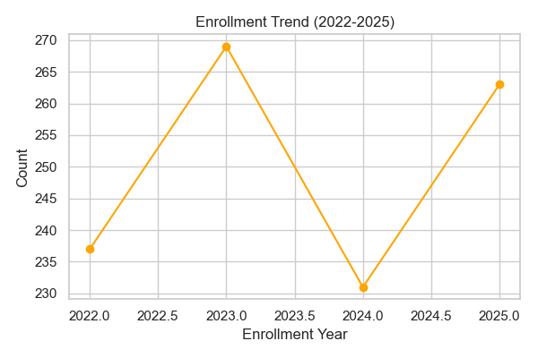
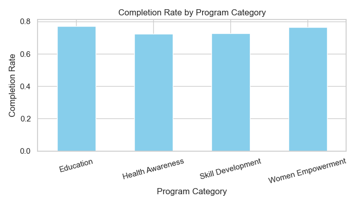
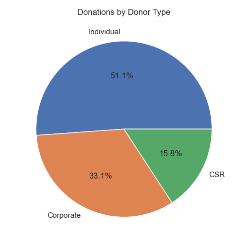

# Simple Data Analytics Project: NayePankh Foundation

This repository contains a simple, entry-level Data Analytics project designed to analyze enrollment and donation trends for the **NayePankh Foundation** NGO.

---

## 📁 Repository Structure
```text
Data_Analyst_Project/
├── visualizations/              # Folder containing output charts
│   ├── enrollment_trend.png     # Line plot of registrations over time
│   ├── program_performance.png  # Bar plot of completion rates
│   └── donor_summary.png        # Pie chart of donor channel share
├── cleaned_ngo_data.csv         # Cleaned flat CSV dataset
├── naye_pankh.db                # SQLite database with a single table (ngo_data)
├── analysis.py                  # Python script (runs pipeline & exports charts)
├── analysis.ipynb               # Jupyter Notebook for interactive run
├── queries.sql                  # Simple SQL queries for database verification
├── report.txt                   # Automated text-based summary report
└── README.md                    # Project landing page (This file)
```

---

## 🛠️ How to Run the Project

### 1. Install Dependencies
Ensure you have python installed, and run:
```bash
pip install pandas numpy matplotlib seaborn
```

### 2. Run Python Script
Execute the analysis script to regenerate datasets, databases, and visualizations:
```bash
python analysis.py
```

### 3. Run Jupyter Notebook
Open [analysis.ipynb](analysis.ipynb) in your Jupyter notebook environment to interact with the code.

---

## 📊 SQL Query Sandbox
You can open `naye_pankh.db` in any SQLite browser and execute the basic reporting queries saved in [queries.sql](queries.sql).

---

## 📈 Visualizations & Insights

Here are the charts generated by the script:

### 1. Annual Enrollment Growth Trend
Tracks how registrations grew from 2022 to 2025.


### 2. Program Performance
Compares completion rates across different NGO categories.


### 3. Donation Share
Breakdown of donation streams sponsoring student seats.


---

## 📋 Generated Text Report
When run, the script outputs a simple text report in [report.txt](report.txt). Below is a sample preview:

```text
NayePankh Foundation - Simple Data Analysis Report
===================================================
Total Beneficiaries: 1000
Overall Completion Rate: 75.00%
Total Funds Utilized: 9,738,450.00 INR
Average Satisfaction Score: 3.01 / 5.0
```
