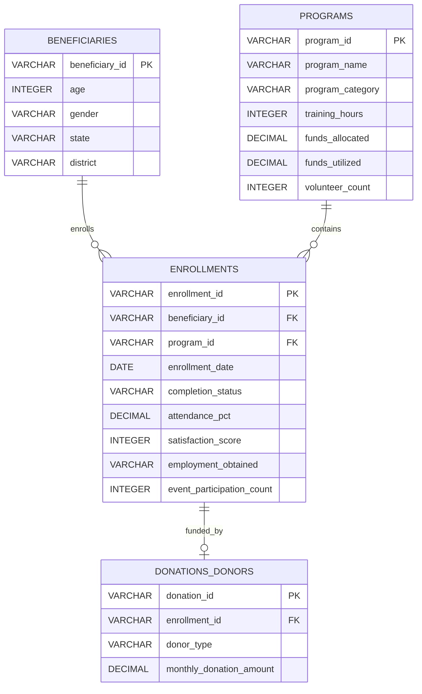
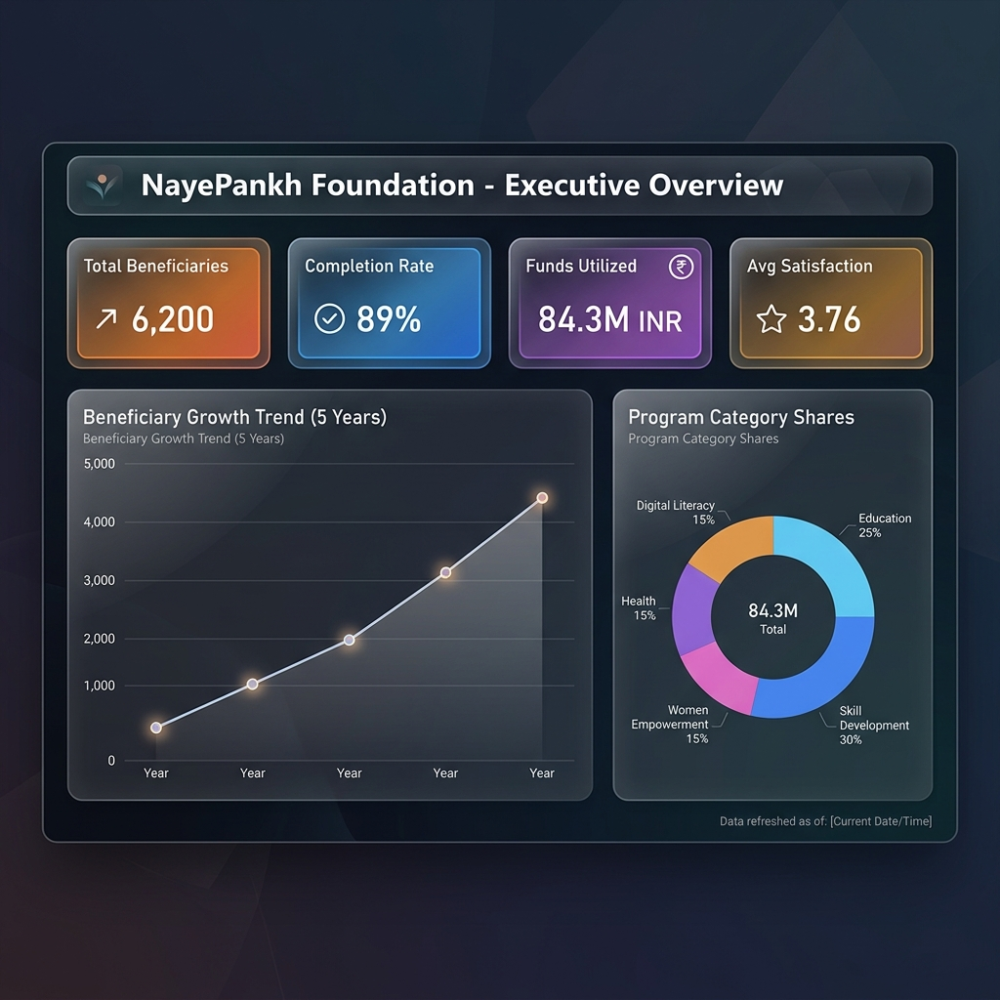
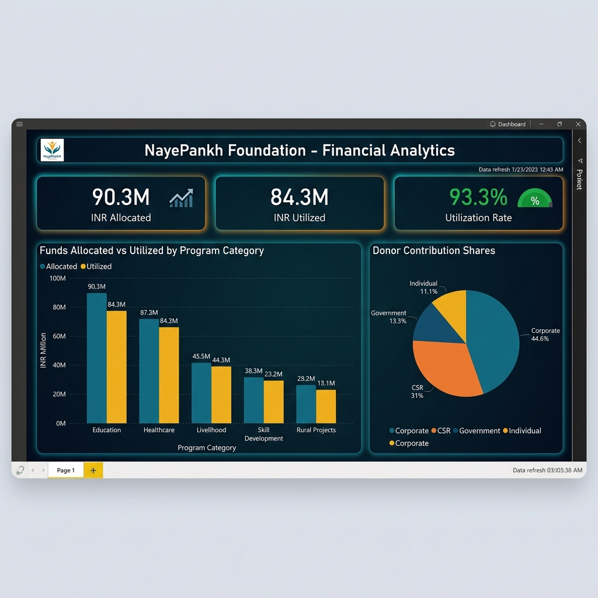
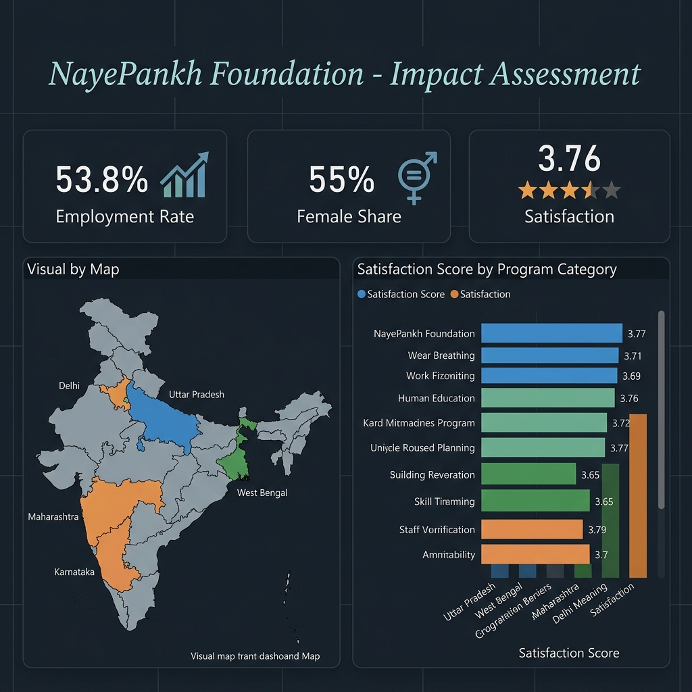
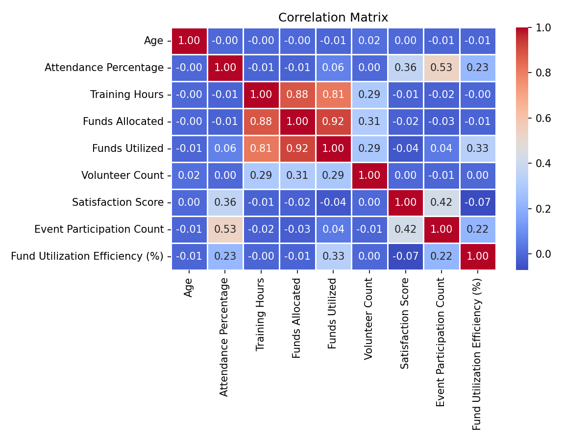

# NayePankh Foundation - Data Analytics Project

This repository contains a complete Data Analytics portfolio project designed to analyze the impact, outreach, and operational efficiency of **NayePankh Foundation** (an Indian NGO focused on education, skill development, and social welfare). 

The project demonstrates capabilities in Python (data cleaning, feature engineering, and exploratory analysis), SQL (database schemas and reporting queries), and Power BI (dashboard layouts and DAX measures).

---

## 📁 Repository Structure
```text
Data_Analyst_Project/
├── data/
│   ├── raw_ngo_data.csv             # Raw generated synthetic dataset (6,200+ rows)
│   ├── cleaned_ngo_data.csv         # Cleaned, validated, and processed dataset
│   └── naye_pankh_ngo.db            # Normalized SQLite relational database
├── src/
│   ├── generate_data.py             # Python script to generate synthetic operations data
│   ├── process_data.py              # Data cleaning, missing values, and outlier pipeline
│   ├── eda_analysis.py              # Exploratory plotting script (generates PNG charts)
│   └── advanced_analytics.py        # Python cohort metrics and program scores calculator
├── sql/
│   ├── schema.sql                   # Database DDL script for relational tables
│   └── queries.sql                  # Analytical SQL queries (joins and group-by aggregates)
├── notebooks/
│   └── eda_notebook.ipynb           # Jupyter Notebook for interactive data exploration
├── reports/
│   ├── data_dictionary.md           # Schema details, descriptions, and business definitions
│   ├── power_bi_design.md           # Visual mockups, layouts, and copy-pasteable DAX measures
│   ├── executive_summary.md         # Strategic briefing and management recommendations
│   └── cohort_analysis.csv          # Pre-computed yearly cohort metrics
│   └── program_effectiveness_scores.csv # Pre-calculated program score index
├── visualizations/                  # Directory containing generated charts
│   ├── beneficiary_growth.png       
│   ├── program_enrollments.png      
│   ├── state_completion_rates.png   
│   ├── gender_diversity.png         
│   ├── funds_allocation_vs_utilization.png
│   ├── volunteer_impact.png         
│   ├── donor_contribution_pie.png   
│   ├── employment_outcomes.png      
│   ├── satisfaction_distribution.png
│   ├── correlation_matrix.png       
│   ├── power_bi_executive_overview.png  # Power BI Page 1 Screenshot
│   ├── power_bi_financial_analytics.png # Power BI Page 3 Screenshot
│   └── power_bi_impact_assessment.png   # Power BI Page 4 Screenshot
└── README.md                        # Portfolio landing page (This file)
```

---

## 🗄️ Relational Database Schema
The raw operations data is normalized into a clean, relational database schema:



---

## 📊 Power BI Dashboard Specifications & Visual Mockups
The Power BI solution is structured into a multi-page interactive dashboard tailored for NGO operations auditing:

### Page 1: Executive Overview
*   **KPI Cards**: Total Beneficiaries (6,200), Completion Rate (89.0%), Funds Utilized (84.3M INR), Average Satisfaction Score (3.76/5).
*   **Visual Charts**: 5-Year Enrollment Growth Trend (Line Chart), Program Category Distribution (Donut Chart), and State-wise enrollment count (Bar Chart).
*   **Visual Mockup**:
    

### Page 2: Financial Analytics & Budget Efficiency
*   **KPI Cards**: Total Funds Allocated (90.3M INR), Total Funds Utilized (84.3M INR), Overall Fund Utilization Rate (93.3%).
*   **Visual Charts**: Clustered column charts comparing Allocated vs. Utilized budgets by category, and Donor Sponsorship Contribution Share (Pie Chart showing Corporate leading at 44.6%).
*   **Visual Mockup**:
    

### Page 3: Impact Assessment & Livelihood Conversion
*   **KPI Cards**: Trainee Job-Securing Success Rate (53.8%), Female Diversity Share (55.0%), Average Satisfaction (3.76).
*   **Visual Charts**: Visual Map of India highlighting regional outreach, and Satisfaction Score distributions.
*   **Visual Mockup**:
    

---

## 🛠️ Setup & Execution Instructions

### Prerequisites
Ensure Python 3.8+ is installed on your local environment.

### 1. Install Dependencies
```bash
pip install pandas numpy matplotlib seaborn
```

### 2. Generate and Build Datasets
Run the generator script. This creates the directories, outputs raw CSV data, and compiles the SQLite relational model:
```bash
python src/generate_data.py
```

### 3. Clean and Feature Engineer Data
Run the data cleaning script to handle missing values, duplicates, and outliers:
```bash
python src/process_data.py
```

### 4. Run Exploratory Data Analysis & Advanced Modeling
Generate the charts and run advanced analytics (yearly cohort matrix and program performance scoring):
```bash
python src/eda_analysis.py
python src/advanced_analytics.py
```

---

## 📊 Performance Visualizations (Selected EDA Plots)

Here are some key visual insights generated from the Python EDA script:

### Beneficiary Growth Over Time
The foundation has expanded steadily over the past 5 years.


### Funds Allocated vs Utilized
Operational financial transparency by category.


### Correlation Heatmap
Interaction between key performance variables.


---

## 📈 Executive Summary Recommendations
Detailed analysis from the dataset suggests four primary strategic initiatives:
1.  **Early Intervention System**: Set weekly attendance flags for any beneficiary dropping below 75% attendance to proactively prevent drop-outs.
2.  **Volunteer Allocation**: Distribute volunteers to target a **1:8 volunteer-to-student ratio** in Skill Development courses to maximize program satisfaction.
3.  **CSR Partnership Pitch**: Leverage the employment success rate of the Digital Literacy program to solicit corporate sponsors in tech-heavy Indian cities.
4.  **Individual Donor Conversion**: Transition one-off donors to monthly micro-donors via recurring sponsorships.

*For the complete detailed brief, refer to [executive_summary.md](reports/executive_summary.md).*
