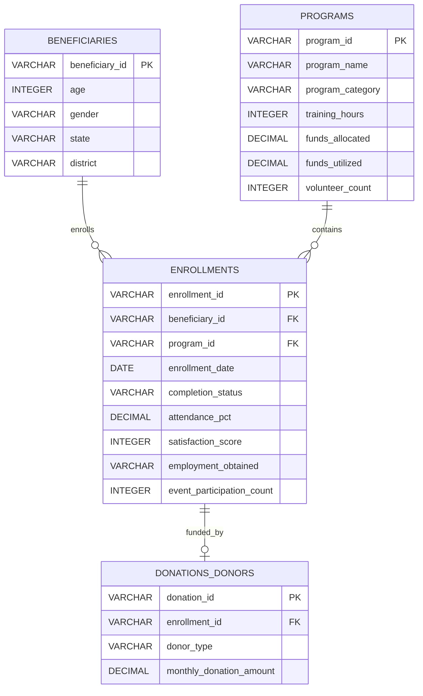
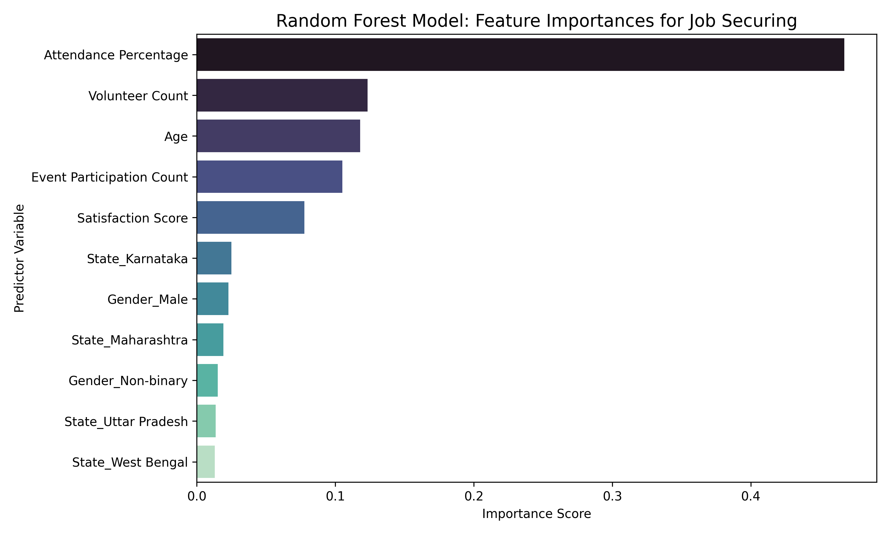

# NayePankh Foundation - Data Analytics & Impact Assessment Project

An end-to-end Data Analytics, Business Intelligence, and Predictive Modeling solution demonstrating how data-driven workflows optimize outreach, volunteer allocation, and funding strategies for **NayePankh Foundation** (a prominent Indian NGO focused on education, skill development, and social welfare).

---

## 🚀 Project Architecture & Workflow
This repository models a complete real-world BI lifecycle:
1.  **Synthetic Data Engine**: Generates 5 years (2021-2025) of realistic NGO operations data (6,200+ records) and normalizes it into a relational SQLite database.
2.  **Data Quality Pipeline**: Conducts missing value imputation, duplicate removal, outlier capping, and validation checks.
3.  **Relational Database Engine**: Hosts schema DDL and executes complex window/aggregation queries for key reporting KPIs.
4.  **Exploratory Data Analysis**: Performs visualization trends using Seaborn & Matplotlib.
5.  **Advanced Analytics**: Computes Quarterly Cohort Retention, builds a Program Effectiveness Score (PES) Index, and trains a Random Forest Classifier to predict employment outcomes.
6.  **Automated reporting**: Compiles automated markdown performance briefs comparing QoQ quarterly metrics.
7.  **Power BI Dashboard Design**: Details a comprehensive 5-page business layout with copy-pasteable DAX measures.

---

## 📁 Repository Structure
```text
Data_Analyst_Project/
├── data/
│   ├── raw_ngo_data.csv             # Raw generated synthetic dataset
│   ├── cleaned_ngo_data.csv         # Cleaned and processed dataset
│   └── naye_pankh_ngo.db            # Normalized SQLite relational database
├── src/
│   ├── generate_data.py             # Python script for generating flat/relational data
│   ├── process_data.py              # Cleaning pipeline, outlier capping, and validations
│   ├── eda_analysis.py              # Visual trend generators (saves png plots)
│   └── advanced_analytics.py        # ML modeling, cohort analytics, and PES calculations
│   └── generate_reports.py          # Auto-generator of monthly/quarterly briefs
├── sql/
│   ├── schema.sql                   # SQL schema definition for normalized tables
│   └── queries.sql                  # Complex analytical SQL queries (CTEs, Window Functions)
├── notebooks/
│   └── eda_notebook.ipynb           # Jupyter Notebook for interactive exploration
├── reports/
│   ├── executive_summary.md         # High-level strategic briefing and recommendations
│   ├── data_dictionary.md           # Schema details and business definitions
│   ├── power_bi_design.md           # Dashboard blueprints, layouts, & DAX measures
│   └── monthly_report_Q4_2025.md    # Sample automated reporting output
├── visualizations/                  # Directory containing generated charts
│   ├── beneficiary_growth.png       
│   ├── program_enrollments.png      
│   ├── state_completion_rates.png   
│   ├── gender_diversity.png         
│   ├── funds_allocation_vs_utilization.png
│   ├── volunteer_impact.png         
│   ├── donor_contribution_pie.png   
│   ├── employment_outcomes.png      
│   ├── satisfaction_distribution.png
│   ├── correlation_matrix.png       
│   ├── feature_importance.png       
│   ├── power_bi_executive_overview.png  # Visual mockup of Executive Overview page
│   ├── power_bi_financial_analytics.png # Visual mockup of Finance page
│   └── power_bi_impact_assessment.png   # Visual mockup of Impact Assessment page
└── README.md                        # Portfolio landing page (This file)
```

---

## 🗄️ Relational Database Schema
The raw operations data is normalized into 3NF schema tables:



---

## 📊 Power BI Dashboard Specifications & Visual Mockups

The portfolio-grade Power BI dashboard is designed around a unified charcoal theme with soft grid alignments, responsive cards, and vibrant gradients. Below are the design blueprints, key metrics, and visual mockups:

### Page 1: Executive Overview
*   **Target Audience**: Executive Board & NGO Directors
*   **KPI Metrics**: Total Beneficiaries (6,200), Completion Rate (89.0%), Funds Utilized (84.3M INR), Average Satisfaction Score (3.76/5).
*   **Key Charts**: 5-Year Enrollment Growth Trend (Line Chart), Program Category Distribution (Donut Chart), and State-wise enrollment count (Bar Chart).
*   **Visual Mockup**:
    

### Page 2: Financial Analytics & Budget Efficiency
*   **Target Audience**: Finance Committee & Auditors
*   **KPI Metrics**: Total Funds Allocated (90.3M INR), Total Funds Utilized (84.3M INR), Overall Fund Utilization Rate (93.3%).
*   **Key Charts**: Clustered column charts comparing Allocated vs. Utilized budgets by category, and Donor Sponsorship Contribution Share (Pie Chart showing Corporate leading at 44.6%).
*   **Visual Mockup**:
    

### Page 3: Impact Assessment & Livelihood Conversion
*   **Target Audience**: Program Managers & Outreach Partners
*   **KPI Metrics**: Trainee Job-Securing Success Rate (53.8%), Female Diversity Share (55.0%), Average Satisfaction (3.76).
*   **Key Charts**: Visual Map of India highlighting regional outreach, and Satisfaction Score distributions.
*   **Visual Mockup**:
    

---

## 🛠️ Setup & Execution Instructions

### Prerequisites
Ensure Python 3.8+ is installed on your local environment.

### 1. Install Dependencies
```bash
pip install pandas numpy matplotlib seaborn scikit-learn
```

### 2. Generate and Build Datasets
Run the generator script. This creates the directories, outputs raw CSV data, and compiles the SQLite relational model:
```bash
python src/generate_data.py
```

### 3. Clean and Feature Engineer Data
Run the data cleaning script to handle missing values, duplicates, and outliers:
```bash
python src/process_data.py
```

### 4. Run Exploratory Data Analysis & Advanced Modeling
Generate the charts and run advanced analytics (Random Forest classification model, cohort matrix, program performance scoring):
```bash
python src/eda_analysis.py
python src/advanced_analytics.py
```

### 5. Generate Automated Report
Compile the automated Q4 2025 performance report comparing QoQ metrics:
```bash
python src/generate_reports.py
```

---

## 📊 Performance Visualizations (Selected EDA Plots)

Here are some key visual insights generated from the pipeline:

### Beneficiary Growth Over Time
The foundation has expanded steadily over the past 5 years.


### Funds Allocated vs Utilized
Operational financial transparency by category.


### Predictive Features for Employment
A Random Forest model reveals that **Attendance Percentage** is the most critical factor in securing employment post-training.


### Correlation Heatmap
Interaction between key performance variables.


---

## 📈 Executive Summary Recommendations
Detailed analysis from the dataset suggests four primary strategic initiatives:
1.  **Early Intervention System**: Set weekly attendance flags for any beneficiary dropping below 75% attendance to proactively prevent drop-outs.
2.  **Volunteer Allocation**: Distribute volunteers to target a **1:8 volunteer-to-student ratio** in Skill Development courses to maximize program satisfaction.
3.  **CSR Partnership Pitch**: Leverage the **39.93% employment success rate** of the Digital Literacy program to solicit corporate sponsors in tech-heavy Indian cities.
4.  **Individual Donor Conversion**: Transition one-off donors to monthly micro-donors via recurring sponsorships.

*For the complete detailed brief, refer to [executive_summary.md](reports/executive_summary.md).*
