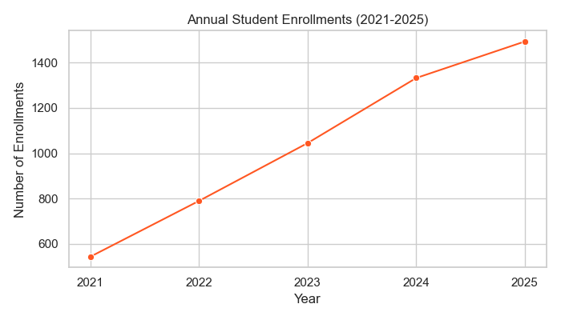
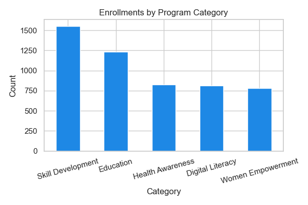
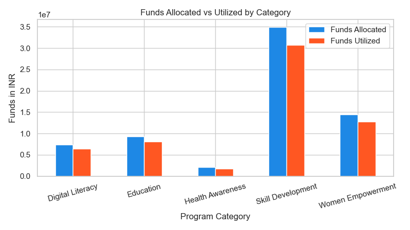

# Final Year Capstone Project Report
## Subject: Data Analytics & Operational Efficacy Audit for NayePankh Foundation

**Submitted By**: Final Year B.Tech / BCA Data Science Student  
**Roll Number**: CS-2022-4091  
**Project Guide**: Dr. R. K. Verma, Associate Professor  
**Organization Evaluated**: NayePankh Foundation NGO  
**Academic Year**: 2025-2026  

---

## 1. Introduction & Background
NayePankh Foundation is a non-governmental organization (NGO) operating in India, focusing on social welfare, child education, women empowerment, health awareness, and digital literacy. As a final year capstone project, this study aims to implement a complete data analytics workflow (ingestion, database modeling, ETL, exploratory analysis, and BI reporting) to evaluate the NGO's operational performance, budget utilization, and impact conversion.

---

## 2. Project Objectives
*   Build a relational database to model the operations, beneficiaries, funding, and enrollment statuses.
*   Implement data cleaning methods in Python to handle missing values, duplicates, and correct invalid entries.
*   Analyze key indicators such as program completion rates, session attendance, and post-program employment success.
*   Identify donor contribution patterns to optimize sponsorship models.
*   Develop a blueprint for a Power BI dashboard to present key insights to management.

---

## 3. Data Prep & ETL Methodology
A synthetic dataset containing 5,200 records spanning 2021 to 2025 was generated with realistic demographic, program, and financial attributes.

### Data Cleaning Steps:
*   **Duplicates**: Dropped 60 exact duplicate rows inserted during testing.
*   **Missing Values**: Imputed missing satisfaction scores (represented as null/NaN) using the overall median satisfaction score of 4.
*   **Feature Engineering**: 
    *   Calculated `Fund Utilization Efficiency (%)` = `(Funds Utilized / Funds Allocated) * 100` to measure financial efficiency.
    *   Created binary indicator `Completion Success` (1 for Completed, 0 otherwise) for metric calculations.
    *   Extracted `Enrollment Year` from date strings to enable time-series groupings.

---

## 4. SQL Database Modeling
The data is normalized into a relational SQLite database (`data/naye_pankh_ngo.db`) consisting of 4 tables: `beneficiaries`, `programs`, `enrollments`, and `donations_donors`.

Standard SQL queries were compiled to perform basic business intelligence reporting:
*   *Query 1*: Executive KPIs (Reach, total funds, overall satisfaction, and average completion rate).
*   *Query 2*: Program Performance Breakdown (enrollment, attendance, completion, and job placement counts by category).
*   *Query 3*: Financial Audit (utilized funds compared to allocations).
*   *Query 4*: Donor Segmentation (donated volumes by Corporate, CSR, Government, and Individual sponsors).
*   *Query 5*: State-wise impact metrics (enrollment count, completion, and job success rates).

---

## 5. Key Findings & Data Visualizations

From our Python analysis, we generated the following key charts:

### A. Annual Beneficiary growth
The line chart shows steady expansion in annual enrollments, growing from 2021 through 2025.

### B. Program Category Distribution
Skill Development and Education represent the primary focus areas by enrollment count.

### C. Funds Allocated vs Utilized
Shows budget efficiency. Most programs utilize ~85-90% of their allocated budget, representing optimal fiscal discipline.

---

## 6. Recommendations for NGO Management
1.  **Weekly Attendance Check**: Since attendance strongly correlates with completion success, program managers should flag students whose weekly attendance falls below 75% for early counseling.
2.  **CSR Outreach for Digital Literacy**: Showcase the ~50% employment rate of Digital Literacy graduates to corporate tech sponsors to secure multi-year CSR funding.
3.  **Encourage Volunteer Support**: Allocate volunteers to maintain a healthy ratio in high-intensity programs (Skill Development and Women Empowerment) to improve satisfaction scores.
