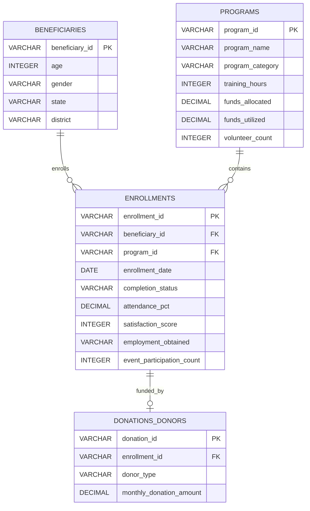

# Data Dictionary - NayePankh Foundation Data Analytics

This document contains descriptions, data types, constraints, and business logic for both the flat CSV export and the normalized SQLite database models used in the NayePankh Foundation analytics project.

---

## 1. Relational SQLite Schema Model
To showcase database design and SQL proficiency, the raw data is normalized into four relational tables.

---

## 2. Flat Dataset Column Specifications
For Power BI dashboard building and raw analysis, the flat CSV (`raw_ngo_data.csv` and `cleaned_ngo_data.csv`) contains the following consolidated fields:

| Column Name | Data Type | Description | Values / Range | Business Rules & Constraints |
| :--- | :--- | :--- | :--- | :--- |
| **Beneficiary ID** | VARCHAR | Unique identifier for each beneficiary. | e.g., `BEN-00001` to `BEN-06000` | Primary key representation. |
| **Age** | INTEGER | Age of the beneficiary at enrollment. | 15 - 65 years | Must be positive. Primary focus is youth and adult employment/literacy. |
| **Gender** | VARCHAR | Gender of the beneficiary. | `Male`, `Female`, `Non-binary` | Used for impact metrics and diversity tracking. |
| **State** | VARCHAR | Indian state where the beneficiary resides. | `Uttar Pradesh`, `Maharashtra`, `Delhi`, `Karnataka`, `West Bengal` | Standardized state naming conventions. |
| **District** | VARCHAR | District within the selected state. | Various (e.g., Lucknow, Noida, Pune, Mumbai, etc.) | Must map accurately to the selected state. |
| **Program Category** | VARCHAR | Strategic focus area of the enrolled program. | `Education`, `Skill Development`, `Women Empowerment`, `Health Awareness`, `Digital Literacy` | Categorical list. Drives training hours and employment expectations. |
| **Enrollment Date** | DATE | The date the beneficiary enrolled in the program. | `2021-01-01` to `2025-12-31` | Spans 5 years. Format: `YYYY-MM-DD`. |
| **Program Completion Status** | VARCHAR | Status of the beneficiary's enrollment in the program. | `Completed`, `Dropped Out`, `Ongoing` | Drop-out indicates premature termination; Ongoing represents current participants. |
| **Attendance Percentage** | DECIMAL | Percentage of program sessions attended by the beneficiary. | 0.00% - 100.00% | High attendance (>=75%) is correlated with higher completion and employment. |
| **Training Hours** | INTEGER | Total training hours allocated to the program category. | 10 - 250 hours | Coaligned with Program Category: Education (~80h), Skill Dev (~200h), Women Emp (~120h), Health (~10h), Digital Lit (~60h). |
| **Funds Allocated** | DECIMAL | Total budget allocated per beneficiary-program enrollment. | 2,000 INR - 50,000 INR | Budgeted cost. Varies by program category resource requirements. |
| **Funds Utilized** | DECIMAL | Actual funds spent on the beneficiary program enrollment. | 0 INR - 60,000 INR | Used to evaluate financial efficiency. Might contain outliers (utilization > allocation). |
| **Volunteer Count** | INTEGER | Number of volunteers supporting the program batch. | 1 - 15 volunteers | Tracks volunteer mobilization per cohort. |
| **Satisfaction Score** | INTEGER | Post-program feedback satisfaction score from beneficiary. | 1 (Very Dissatisfied) - 5 (Very Satisfied) | Null/missing values exist for dropped or ongoing beneficiaries. |
| **Employment Obtained After Training** | VARCHAR | Whether the beneficiary secured employment/livelihood post-training. | `Yes`, `No` | Mostly relevant for Skill Development & Digital Literacy. Should be `No` or `N/A` for others unless specifically successful. |
| **Monthly Donation Amount** | DECIMAL | Donation amount associated with the sponsor/donor for this program seat. | 0 INR - 25,000 INR | Sponsored funds. 0 indicates no specific single donor sponsorship. |
| **Donor Type** | VARCHAR | Source type of the sponsorship donation. | `Individual`, `Corporate`, `CSR`, `Government`, `None` | CSR (Corporate Social Responsibility) and Corporate represent institutional funding. |
| **Event Participation Count** | INTEGER | Count of community outreach events attended by the beneficiary. | 0 - 8 events | Measures engagement beyond classroom hours. |

---

## 3. Derived KPIs and Feature Engineered Fields
To enhance analysis, the following calculated columns are created in processing:

1.  **Fund Utilization Efficiency (`fund_util_pct`)**:
    *   *Formula*: `(Funds Utilized / Funds Allocated) * 100`
    *   *Business Logic*: Measures financial prudence. Values > 100% represent budget overruns. Values < 80% indicate under-utilization of resources.
2.  **Age Group (`age_group`)**:
    *   *Formula*: `CASE WHEN Age < 25 THEN 'Youth (15-24)' WHEN Age < 45 THEN 'Adult (25-44)' ELSE 'Mature (45+)' END`
    *   *Business Logic*: Demographic segmentation to tailor program outreach.
3.  **Completion Success Score (`completion_success`)**:
    *   *Formula*: Boolean value (1 if `Completed`, 0 otherwise). Used for calculating program completion rates.
4.  **Employment Conversion Rate (`employment_rate`)**:
    *   *Formula*: `Total Employed Beneficiaries / Total Beneficiaries Enrolled in Employment-seeking Programs` (Skill Dev and Digital Literacy).
5.  **Retention Category (`engagement_level`)**:
    *   *Formula*: Based on `Attendance Percentage` and `Event Participation Count`.
    *   `High`: Attendance >= 85% AND Participation >= 3.
    *   `Medium`: Attendance >= 70% OR Participation >= 2.
    *   `Low`: Everyone else.
